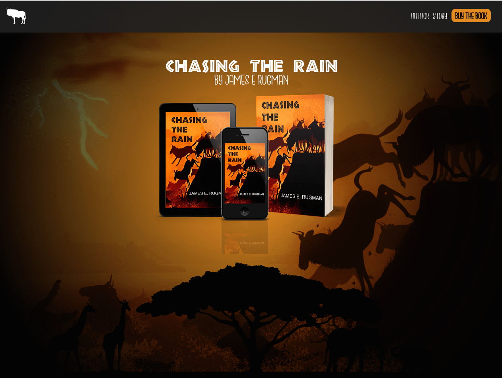

###project outline
This is an ongoing project. My brother recently completed his first novel. He wanted a website to allow visitors to learn a little bit about the novel, the author and a link to the book on Amazon.

I had recently been working with React and thought that this would be a great project to build with GatsbyJS.

###home page

###author page

