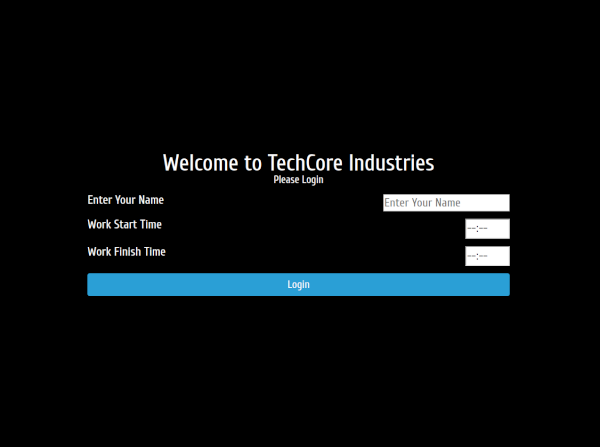
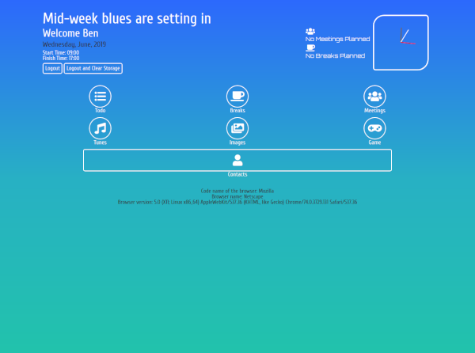

###project outline
This project was part of my Web Development and Design course. After studying Javascript, I wanted to put into practice many aspects of the language I had learned.. The entire ‘app’ is written in vanilla Javascript. It has a very basic login system that uses local storage. It was never meant to be a production application. It was a sandbox project for me to explore Javascript and use it in a number of different ways to manipulate the DOM, make API calls and store information in Local Storage.

###login screen

###homepage

