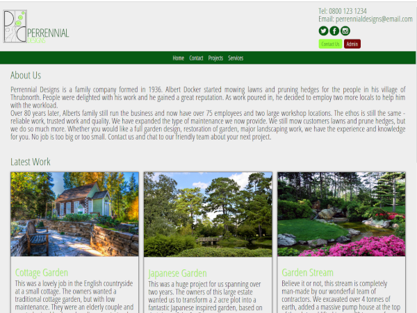
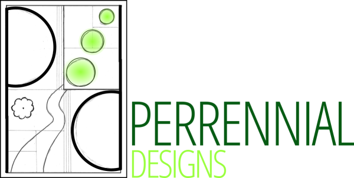
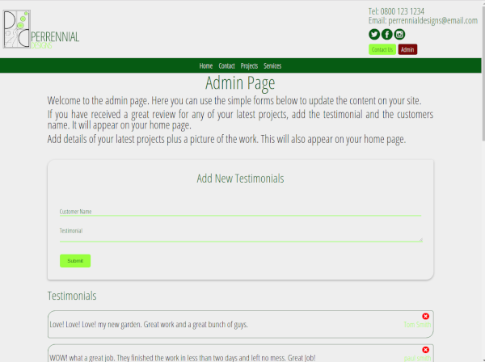
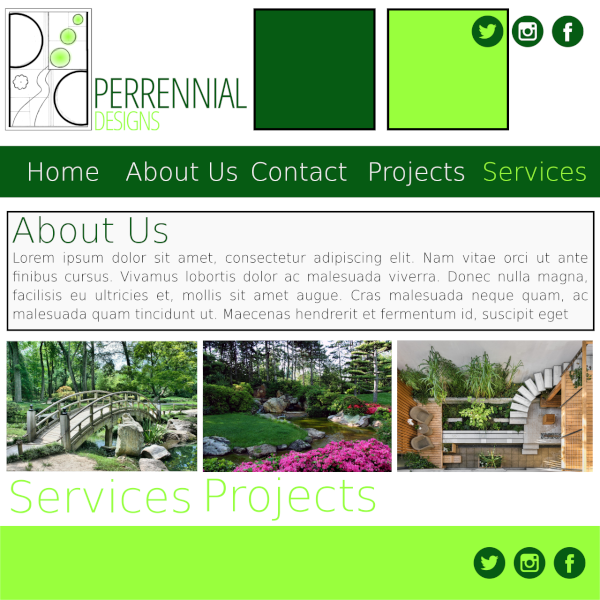
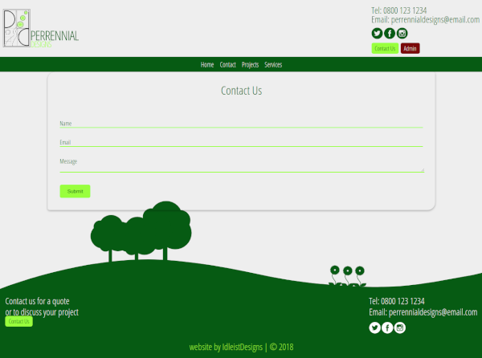

###project outline
This is a concept web site. It is based on a family gardening landscape company. I used this project as a building block to carry out a fully functioning site from the initial planning and mockup stages, the full design of a logo and the implementation of a node back end. The goal of this website was to produce a dynamic company site with it’s own simple content management system. Many clients wish to change details on their sites, but are often confused by the available CMS’s available. This site would allow the owners of the site to change content easily, including adding testimonials and updating their latest work.

This website is not production ready. As you can see from the demo, there is an accessible admin page. In final production, this would be accessible via a hidden html route and a login system for the administrators of the website (similar to Wordpress).

I also used the nodemailer package for a fully functional contact form and the multer package to allow the uploading of images to the web page.

###home page

###logo
The logo was created in inkscape. I wanted to convey the landscaping aspect of the company. The logo incorporates the feel of a technical drawing with the initials of the company.

###admin page

###moodboard
I wanted a clean design with a good use of whitespace, but with colours that convey that this is a gardening website. I chose two contrasting greens to add interest and accent colours on the website.

###contact page

