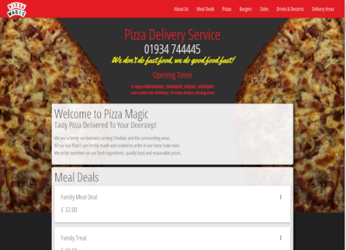

###project outline
This was my first full website build. It was the project that set me on the journey of choosing web development as my future career. My parents owned this Pizza Takeaway business. They had a very basic website in place. It served it’s purpose, but was outdated and written in an older version of HTML. With the rise in smartphone use, I was aware that any new website would need to be fully responsive and look great on all devices. This was a great project for me, as I had the branding and colours to work with, I just had to improve the look and functionality of the site.

I used Materialize CSS for the responsive navigation, images and meal deal cards. I took all the food photos myself and used Gimp to edit all the photos and logos for use on the site.

I am aware that this site is basic and lacks the design flare of many sites, however as a first project, it was a great learning experience for me and it fulfils all the criteria that was set out at the start of the project.

###home page

###logo

