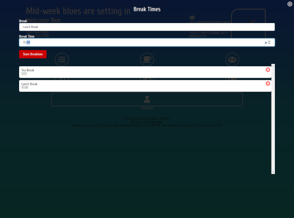

```grid|3



```

### PROJECT OUTLINE

I wanted to include this portfolio within my projects pages. I built this site in NodeJS, using the pug templating language. The portfolio has a working contact form using the Nodemailer package. Form validation is included server-side with the express-validator package. I have utilised SCSS for styling, as I can use cross site global variables and mixins for reusable code.

### PLANS

I wanted to add some personalisation to the website. I have used svg’s designed in Inkscape to add interest to the page. My backdrop for the about section is a representation of my career journey from conservationist to developer.


I love working with Inkscape and designing simple, representative images for use in my webpages.


