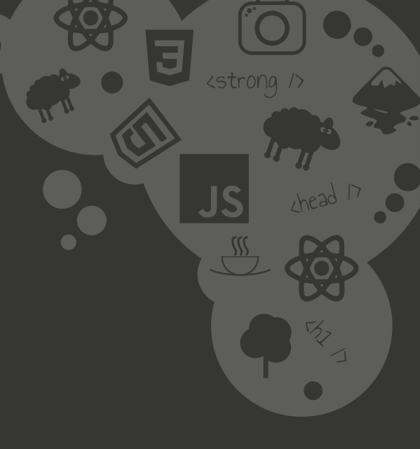

### PROJECT OUTLINE

I wanted to include this portfolio within my projects pages. This site was built using Gatsby JS and graphql. All the images and screenshots on the site are optimized using gatsby image. Information about each project has been written in markdown and pulled in to the site with graphql queries.

I had used Gatsby JS on a previous project and loved the ability to create a static site using the React framework. Using graphql takes a while to get your head around, but it is an upcoming technology and I wanted to experiment with it. I found it a great addition to this project, and feel confident about using it in future projects and with different frameworks.

Gatsby works well with SCSS, and the site is styled using SCSS with modular styling and styled components.

### PLANS

I wanted to add some personalisation to the website. I have used svg’s designed in Inkscape to add interest to the page. My backdrop for the about section is a representation of my career journey from conservationist to developer.

I love working with Inkscape and designing simple, representative images for use in my webpages.

