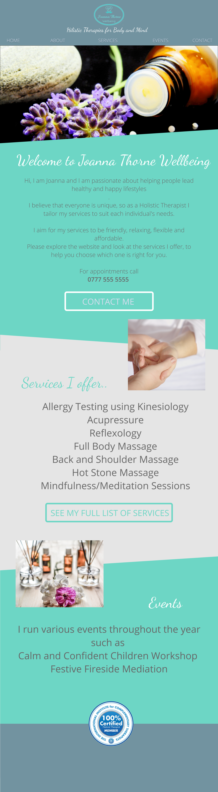

### testimonial

> "I had no idea where to begin in setting up a website. Ben took all the stress out of it with his creative designs and quick work. His client care is exceptional, my requests for little changes were never too much trouble and he answered my questions quickly. I now have a professional website that is easy to navigate and clearly displays all my services."

###project outline
The client had a small home business and had built up an online presence on social media. She had wanted a website for a while but was not sure how to go about it and was confused about hosting a website. I met with the client and we discussed what she wanted from the website.

I used bootstrap and JQuery for responsive styling and navigation toggle for smaller devices. I think the design is clear and conveys all the information required by the client.

###plans

We discussed colours and gathered content for the website. After offering a number of designs, the client liked this mockup, which I designed in Inkscape.

